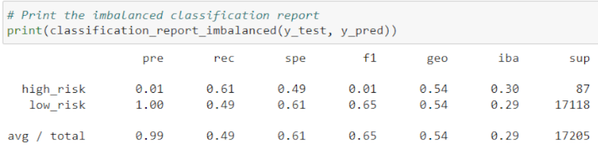

# An Analysis of Credit Risk Related to Credit Card Services

### *Files*:
- [credit_risk_resampling](credit_risk_resampling.ipynb)

- [credit_risk_ensemble](credit_risk_ensemble.ipynb)

## **Project Overview**:
This analysis was conducted with the intent of weighing multiple influential factors presented in recorded data to predict the risk probability when issuing a credit card to a potential customer. By analyzing the data values provided in a CSV file by LendingClub lending services company, multiple statistical models were created through machine learning techniques to find the most accurately-predicting models when trained and tested by sample sets from the retrieved dataset. With a mix of techinques for handling class imbalance, random forest models, and adaptive boosting to build stronger models; a score for balanced accuracy and calculations of statistical alignment were generated for each model created. When confronting the difficulty in correctlty identifying credit fraud cases and high risk lending scenarios, a comparison of each model performs is necessary to potentially overcome the high potential of models incorrectly identifying cases due to the ratio of high-risk to low-risk cases. Without a close enough ratio between included data points in each class, the ability to train and test a model for accurate results has been a consistently difficult situation to confront.

## **Results**:
The following are screenshots of the resulting scores each model received after being tested with a sample set of data points:

### Oversampling Techniques:
- Random Oversampling: 
  - 
- As shown in the image above, the random oversampling technique's implementation resulted in an accuracy score of 62 % and the report provided a precision score of 99 %, while the sensitivity score was 66 %. While not the lowest scores for accuracy compared to the other models created and tested, the accuracy score of 62% is only 12% more accurate than the threshold needed of 50% for the model to take credit for accurate classifications. Based on this accuracy score and the low sensitivity score, this is definitely not a great model to try using for determining the risk of providing credit to new clients.

- SMOTE Oversampling:
  - 
  -  
- As the reports show, the SMOTE model had a balanced accuracy score of 58% when tested and had a precision score of 99% while having a sensitivity score of 66%. The accuracy score ended up being the second-worst of the six models, indicating this case of oversampling with synthetic values did more to hurt the accuracy than to help when compared to the random oversampling done previously. These results make it clear that, while no one technique is best for all datasets, this technique was not effective in creating a model that could be used for any credible determinations.

### Undersampling Technique:
- Cluster Centroids
  - 
  - 
- The cluster centroids model ended up with the lowest scores from any of the models, receiving an accuracy score of 55% while the reported precision score was 99% and the sensitivity score returned 49% on average. These scores clearly showed that, like the SMOTE techinque, this method of synthetic data generation to rebalance the classes was not an effective tool for use on this dataset. It seems to potentially be the case that synthetic data value generation with undersampling made the ability to detect high-risk credit scenarios is generally the least effective way to handle the large difference between limited cases of high credit risk and the multitude of low credit risk cases.

### Combination Sampling Technique:
- SMOTEENN Sampling:
  - 
  - 
- The SMOTEENN model received a 65% accuracy score when tested and a precision score of 99% while the sensitivity score was 57% on average. Using the SMOTEENN method, the use of synthetic data generation was slightly better in the accuracy score when a combination of over and under-sampling were used. Despite this slight improvement, however, the sensitivity score is still very low for being able to detect high credit risk and it would seem synthetic data generation for class rebalancing is still proving to be ineffective at creating an effective model for predicting high credit risk.

### Ensemble Learner Algorithms:
- Balanced Random Forest Classifier:
  - 
  - 
- As the images show above, the Balanced Random Forest Classifier model resulted in a 74% accuracy score when tested and a precision score of 99% with a sensitivity score of 88%. Based on these values, the combination of decision trees in the random forest method was much more effective at handling accurate classification of data when compared to the resampling techniques implemented above. This improvement shows combining "weak learner" algorithms is a more effective tool when dealing with the difficulties presented in this dataset.

- Adaptive Boost Classifier:
  - 
  - 
- The Adaptive Boost Classifier model resulted in the highest accuracy scores out of all models, with a 94% accuracy score when tested and had a 100% precision score along with a sensitivity score of 94% on average. This method of successively building models based on the results of previously run ones proved to be the most effective way to handle this dataset, though with scores at such a high level there is a concern about the presence of overfitting with this model type.

## **Summary**:
Based on the results from each tested model, the one with the greatest accuracy was the Adaptive Boosted Classifier with 94% balanced accuracy score and the same result for the sensitivity score while reaching 100% when scored for precision in the imbalanced classification report. This model showed a great ability to adjust to the dataset presented and more accurately predict high-risk credit cases than any of the other models implemented. This high level of accuracy, however, also raises concerns that the model has become too adapted to this dataset and its performance will likely suffer when presented with another dataset without re-adapting to it first. The overfitting problem presented with such an adapted model leads to similar problems as the oversampling, undersampling and combination sampling models, with the accuracy of classifying data in different datasets being vital to the goal of the project.

The second-best model tested on this dataset was the Balanced Random Forest Classifier, which had much more ideal scores for determining accuracy. While not capable of being considered a perfect model, the values of 74% accuracy and 88% sensitivity are much more realistic as a model that can be applied to various datasets and show great improvment over the other models that utilized resampling techniques. The practice of comparing the results of multiple decision trees to improve the accuracy of conclusions seems to be the clearest way to refine the accuracy of determinations made by the model without introducing too much bias. By making each model more reliant on the performances of previous models and all having built their accuracy based on the performance of previous ones, they are specifically building accuracy but only when interacting with a single dataset.

When considering ways to identify trends and build more accurate ways to classify data points based on the other values presented in the same dataset, the very concept of determining trends is unique to each dataset and often times a universally ideal technique or method of creating a model is nonexistent. For this dataset, the Balanced Random Forest Classifier is definitely the best option for receiving more accurate and credible conclusions based on credit risk datasets presented to its model. The only conclusion that can be reached about determining the best way to generate a model is to carry out a similar analysis as was conducted for this project. Although, the number of tested models do not need to be 6 types, and each situation will likely be different and require different types and numbers of techniques to be attempted. The best choice is to try a collection of different models with the dataset and see which can classify the data with the highest accuracy without resulting in overfitting the model to the data.
