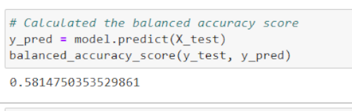

# An Analysis of Credit Risk Related to Credit Card Services

### *Files*:
- [credit_risk_resampling](credit_risk_resampling.ipynb)

- [credit_risk_ensemble](credit_risk_ensemble.ipynb)

## **Project Overview**:
This analysis was conducted with the intent of weighing multiple influential factors presented in recorded data to predict the risk probability when issuing a credit card to a potential customer. By analyzing the data values provided in a CSV file by LendingClub lending services company, multiple statistical models were created through machine learning techniques to find the most accurately-predicting models when trained and tested by sample sets from the retrieved dataset. With a mix of techinques for handling class imbalance, random forest models, and adaptive boosting to build stronger models; a score for balanced accuracy and calculations of statistical alignment were generated for each model created. When confronting the difficulty in correctlty identifying credit fraud cases and high risk lending scenarios, a comparison of each model performs is necessary to potentially overcome the high potential of models incorrectly identifying cases due to the ratio of high-risk to low-risk cases. Without a close enough ratio between included data points in each class, the ability to train and test a model for accurate results has been a consistently difficult situation to confront.

## **Results**:
The following are screenshots of the resulting scores each model received after being tested with a sample set of data points:

### Oversampling Techniques:
- Random Oversampling: 
  - 
  - 
- As shown in the images above, the random oversampling technique's implementation resulted in an accuracy score of 62 % and the report provided a precision score of 99 %, while the sensitivity score was 66 %.

- SMOTE Oversampling:
  - 
  -  
- As the reports show, the SMOTE model had a balanced accuracy score of 58% when tested and had a precision score of 99% while having a sensitivity score of 66%.

### Undersampling Technique:
- Cluster Centroids
  - 
  - 
- The cluster centroids model ended up with an accuracy score of 55% while the reported precision score was 99% and the sensitivity score returned 49% on average.

### Combination Sampling Technique:
- SMOTEENN Sampling:
  - 
  - 
- The SMOTEENN model received a 65% accuracy score when tested and a precision score of 99% while the sensitivity score was 57% on average.

### Ensemble Learner Algorithms:
- Balanced Random Forest Classifier:
  - 
  - 
- As the images show above, the Balanced Random Forest Classifier model resulted in a 74% accuracy score when tested and a precision score of 99% with a sensitivity score of 88%.

- Adaptive Boost Classifier:
  - 
  - 
- The Adaptive Boost Classifier model resulted in a 94% accuracy score when tested and had a 100% precision score along with a sensitivity score of 94% on average.

## **Summary**:
Based on the results from each tested model, the one with the greatest accuracy was the Adaptive Boosted Classifier with 94% balanced accuracy score and the same result for the sensitivity score while reaching 100% when scored for precision in the imbalanced classification report. This model has a design that seemed to indicate it would have a high performance when tested before the calculations had even been executed. The design of the adapative boost classifier model is where a model is trained and evaluated based on its performance accuracy after being tested, with subsequent models being run with improvements included from each previous model created. The key part of this model's greater performance compared to other models is the errors noted from each previously run model are given more weight in the following model with the intent to minimize the impact of similar errors in the subsequent models created. This means with each iteration in the algorithm's execution, the model becomes more accurate with a focus on improving on the specific faults noted up to that point that existed in the previous models. By implementing machine learning in this way, the model can outperform any other form of building on "weak learner" model concepts because it runs sequentially instead of simultaneously as many others do. Not only does this prevent overlap of work done and allows for greater focus on accuracy, it minimizes the level of redundant work being done and the wasted resources that come from it. 

